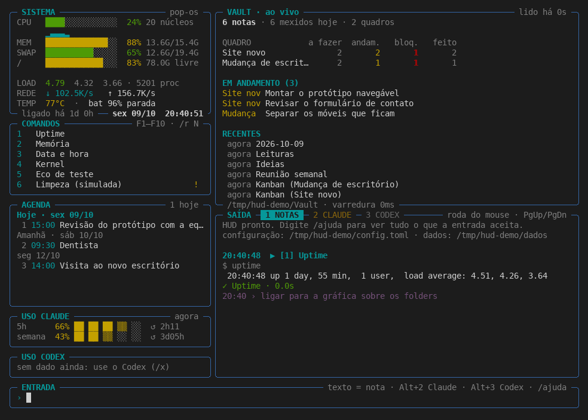
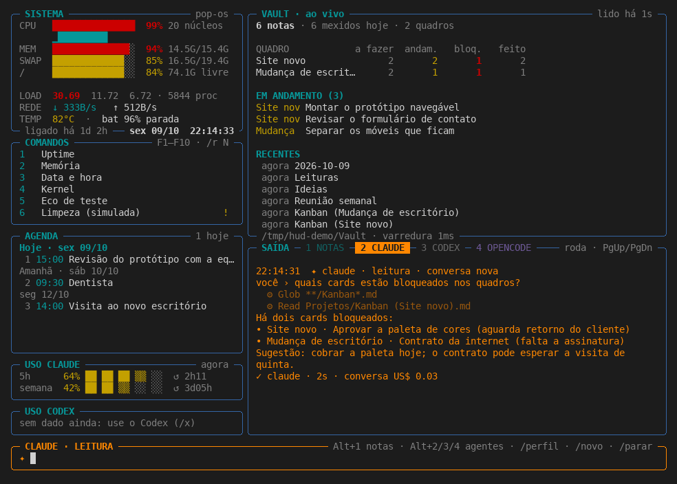
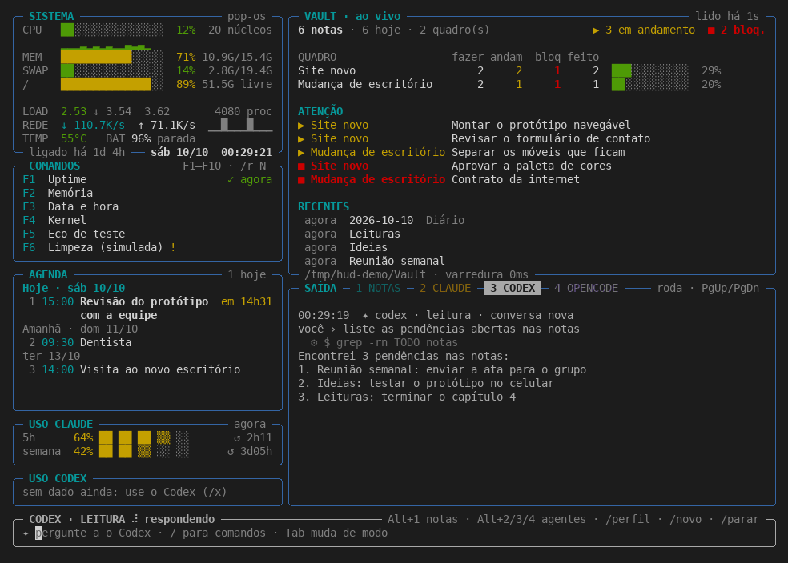
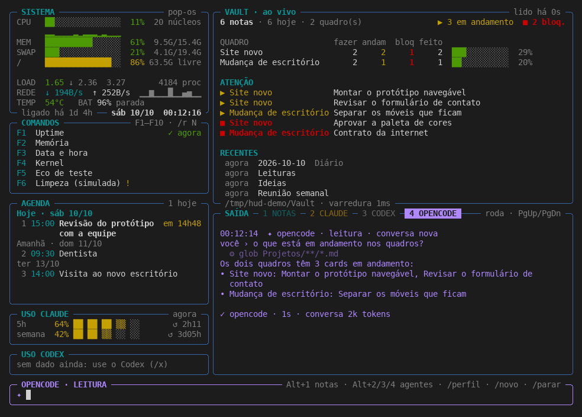
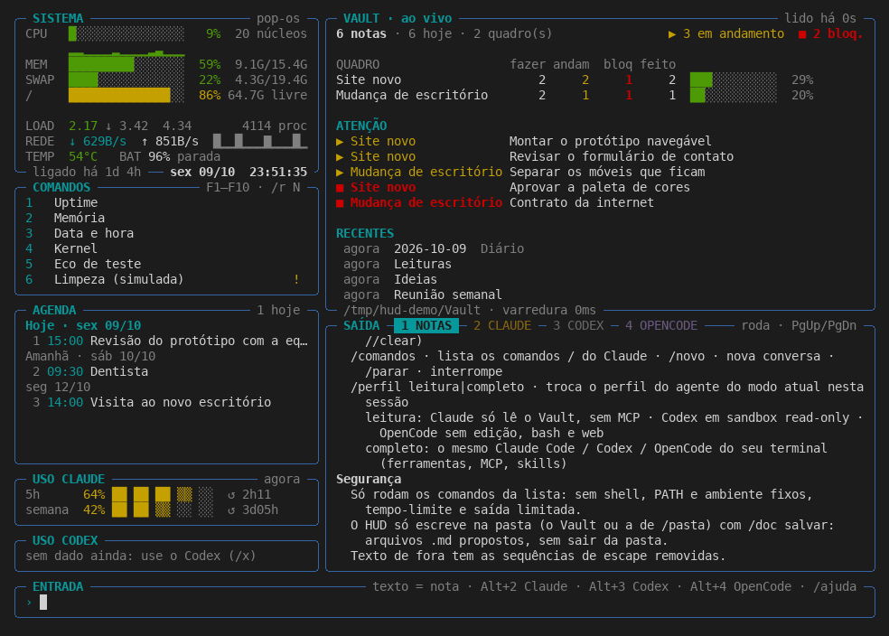
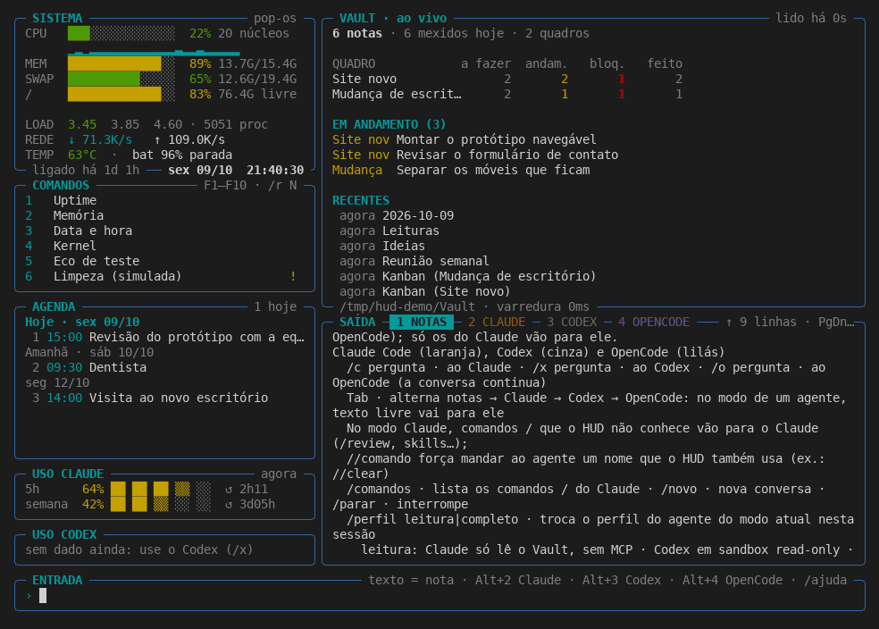
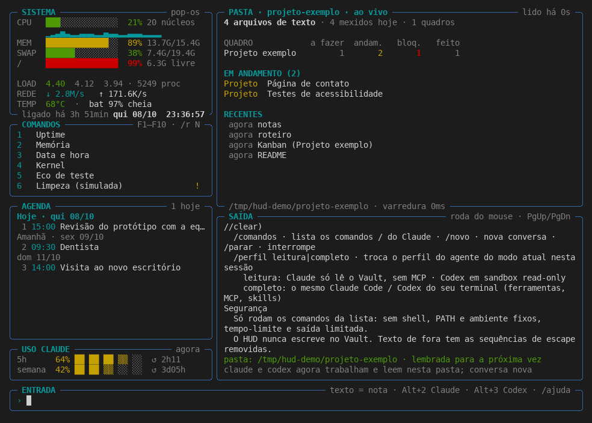
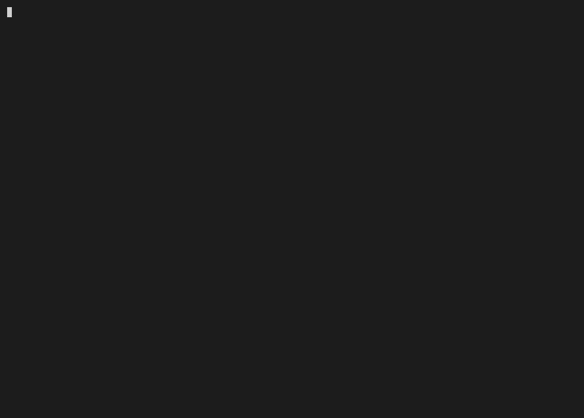

# hud

HUD de terminal numa tela só (a SAÍDA tem uma aba por modo: notas, Claude e Codex): indicadores do sistema, painel de
comandos permitidos, agenda, uso do plano Claude e do Codex, entrada/saída de texto ligada ao
Claude Code e ao Codex local, e o Vault do Obsidian ao vivo. O layout é
customizável: cada painel vai onde você quiser, e dá para criar painéis próprios.

Instala sem Python (binário para Linux amd64/arm64):

```bash
curl -fsSL https://raw.githubusercontent.com/viralabs-dev/hud/main/install.sh | bash
```

O código é Python 3.11+ só com a biblioteca padrão; o binário já traz o Python dentro.

## Telas

Execução real do HUD num pseudo-terminal (pty) de 120×40, com `TERM=xterm-256color` e teclas de verdade. Os PNGs e o GIF são quadros renderizados da gravação, não capturas de tela do desktop. Todos os dados são de demonstração: HOME, Vault, agenda, comandos e cache de uso sintéticos, e o Claude, o Codex e o OpenCode são scripts falsos que respondem no formato real. Só os números do painel SISTEMA (CPU, memória, disco) são da máquina que gravou.

**Revisão gravada:** `9c16766`, em 2026-10-10. Para gravar de novo: `python3 scripts/record-screens.py` (o HUD continua sem dependências; só a renderização usa Pillow, num ambiente virtual temporário).



Tela inicial no modo notas: sistema, comandos, agenda, uso do Claude, Vault ao vivo e a saída na aba NOTAS.



Aba e modo Claude (laranja): uma pergunta e a resposta do Claude falso.



Aba e modo Codex (cinza): a pergunta e a resposta chegando do Codex falso.



Aba e modo OpenCode (lilás): a pergunta e a resposta do OpenCode falso.



/ajuda na saída.



Saída rolada para cima com a roda do mouse.



/pasta com um projeto de exemplo no lugar do Vault.



Sessão inteira, animada: notas, Claude, Codex, OpenCode, ajuda, rolagem e /pasta.

A gravação crua fica em `docs/telas/hud-demo.cast` (asciinema v2), `hud-demo.pty.txt` e `hud-demo.metadata.json` (revisão, duração, teclas enviadas e sha256 do código).

## Instalar

O HUD é distribuído como um binário autocontido: o Python e o `curses` vão
dentro dele, então **não é preciso ter Python instalado**.

| Sistema | Arquitetura | Pacote da release | Instalador | Requisitos |
|---|---|---|---|---|
| Linux | amd64, arm64 | `hud_linux_<arch>.tar.gz` | `install.sh` | glibc 2.35 ou mais nova (Ubuntu 22.04+, Debian 12+, Fedora 36+ e equivalentes) |
| macOS | arm64 (Apple Silicon), amd64 (Intel) | `hud_darwin_<arch>.tar.gz` | `install.sh` | macOS 11 ou mais novo |
| Windows | amd64 (no Windows 11 ARM, pela emulação x64) | `hud_windows_amd64.zip` | `install.ps1` | Windows 10 ou 11, PowerShell 5.1 ou 7+ |
| WSL | amd64, arm64 | o do Linux | `install.sh` | como no Linux |

Distribuições com musl (Alpine) não rodam o binário; use o `pipx` (abaixo).
Os binários não são assinados (nem notarizados pela Apple): veja as notas do
[macOS](#macos-gatekeeper) e do [Windows](#windows).

### Linux e macOS

```bash
curl -fsSL https://raw.githubusercontent.com/viralabs-dev/hud/main/install.sh | bash
export PATH="$HOME/.local/bin:$PATH"   # se ~/.local/bin ainda não estiver no PATH
hud --version
```

O instalador baixa `hud_<linux|darwin>_<arch>.tar.gz` da release, confere o
SHA-256 com o `checksums.txt` da mesma release (sem checksum válido, não
instala; no macOS usa o `shasum -a 256`), grava o binário de forma atômica em
`~/.local/bin/hud` e os avisos de licença de terceiros em
`~/.local/bin/hud-licenses/`. Ele só usa HTTPS (TLS 1.2+), não lê nada do
teclado e se recusa a escrever através de um symlink.

#### macOS: Gatekeeper

O binário do macOS não é assinado com um Developer ID nem notarizado pela
Apple. Instalado pelo `curl | bash`, ele roda normalmente: o `curl` não marca o
arquivo com o atributo de quarentena, e o instalador ainda remove esse atributo
(`xattr -d com.apple.quarantine`) por garantia. Se você baixar o
`hud_darwin_<arch>.tar.gz` pelo navegador e extrair à mão, o Gatekeeper vai
bloquear o `hud` ("não é possível verificar o desenvolvedor"). Nesse caso:

```bash
xattr -d com.apple.quarantine ./hud
```

Num Mac com Apple Silicon, o instalador escolhe o binário arm64 mesmo num
terminal rodando sob Rosetta.

#### Variáveis

| Variável | Padrão | Para quê |
|---|---|---|
| `HUD_VERSION` | `latest` | uma tag `vX.Y.Z` fixa uma versão |
| `HUD_INSTALL_DIR` | `~/.local/bin` | outra pasta de destino |
| `HUD_REPOSITORY` | `viralabs-dev/hud` | outro repositório (um fork) |

```bash
curl -fsSL https://raw.githubusercontent.com/viralabs-dev/hud/main/install.sh |
  HUD_VERSION=v0.5.0 bash
```

Para ler o script antes de rodar:

```bash
curl -fsSLO https://raw.githubusercontent.com/viralabs-dev/hud/main/install.sh
less install.sh
bash install.sh
```

#### Atualizar

Rode o instalador de novo. Ele troca o binário e os avisos; a configuração
(`~/.config/hud/`) e os dados (`~/.local/share/hud/`) não são tocados.

#### Desinstalar

```bash
rm ~/.local/bin/hud
rm -r ~/.local/bin/hud-licenses
```

A configuração e os dados ficam. Para apagar tudo: `rm -r ~/.config/hud ~/.local/share/hud`.

### Windows

No PowerShell (o Windows PowerShell 5.1 que vem com o Windows ou o PowerShell 7),
**sem** "Executar como administrador":

```powershell
irm https://raw.githubusercontent.com/viralabs-dev/hud/main/install.ps1 | iex
hud --version
```

O instalador baixa `hud_windows_amd64.zip` da release, confere o SHA-256 com o
`checksums.txt` da mesma release (`Get-FileHash`; sem checksum válido, não
instala), extrai só os arquivos esperados (recusa caminhos com `..`, absolutos
ou com `:`), testa o `hud.exe --version` e só então troca o binário, de forma
atômica:

- **Onde instala:** `%LOCALAPPDATA%\Programs\hud\hud.exe`, com os avisos de
  licença em `%LOCALAPPDATA%\Programs\hud\hud-licenses\`. Não pede
  administrador e se recusa a rodar elevado sem `HUD_INSTALL_DIR` (instalaria
  no perfil do administrador).
- **PATH:** acrescenta a pasta ao PATH **do usuário** (`HKCU\Environment`, sem
  duplicar e preservando as entradas com `%VARIAVEL%`); o PATH da máquina não é
  tocado. No `irm | iex`, a própria janela já enxerga o `hud`; nos outros
  casos, abra um terminal novo.
- Só usa HTTPS com TLS 1.2+, não lê nada do teclado, não mexe na
  ExecutionPolicy e se recusa a escrever através de symlink ou junction.

As variáveis são as mesmas do Linux (`HUD_VERSION`, `HUD_INSTALL_DIR`,
`HUD_REPOSITORY`), com o padrão de `HUD_INSTALL_DIR` em
`%LOCALAPPDATA%\Programs\hud`:

```powershell
$env:HUD_VERSION = 'v0.6.0'; irm https://raw.githubusercontent.com/viralabs-dev/hud/main/install.ps1 | iex
```

Para ler o script antes de rodar (modo arquivo):

```powershell
irm https://raw.githubusercontent.com/viralabs-dev/hud/main/install.ps1 -OutFile install.ps1
notepad install.ps1
powershell -NoProfile -ExecutionPolicy Bypass -File .\install.ps1
```

O `-ExecutionPolicy Bypass` vale só para esse processo; não é preciso (nem
recomendado) mudar a política do sistema com `Set-ExecutionPolicy`.

**Atualizar:** rode o instalador de novo. Ele troca o `hud.exe` e os avisos; a
configuração e os dados do HUD não são tocados. Feche o HUD antes: o Windows
não deixa trocar um `.exe` em uso.

**Desinstalar:**

```powershell
& ([scriptblock]::Create((irm https://raw.githubusercontent.com/viralabs-dev/hud/main/install.ps1))) -Uninstall
# ou, com o arquivo baixado:
powershell -NoProfile -ExecutionPolicy Bypass -File .\install.ps1 -Uninstall
```

Isso apaga `hud.exe` e `hud-licenses\`, remove a pasta se ela ficar vazia e
tira a entrada do PATH do usuário. À mão, dá no mesmo: apague a pasta
`%LOCALAPPDATA%\Programs\hud` e remova essa entrada em *Configurações → Sistema
→ Sobre → Configurações avançadas do sistema → Variáveis de Ambiente* (as
"Variáveis de usuário").

**SmartScreen e antivírus:** o `hud.exe` não é assinado digitalmente. Instalado
pelo `install.ps1`, o arquivo não recebe a marca de "baixado da internet" e o
SmartScreen não interfere; se você baixar o `.zip` pelo navegador, o Windows
pode avisar ("O Windows protegeu o computador"). Alguns antivírus estranham o
formato do PyInstaller (um `.exe` que se extrai em `%TEMP%` a cada execução);
se o seu bloquear, confira o SHA-256 do pacote com o `checksums.txt` da release
antes de liberar.

### Vindo da instalação antiga (symlink ou pipx)

Se `~/.local/bin/hud` é um symlink, por exemplo para o `bin/hud` do repositório,
o instalador para e diz o que fazer:

```text
hud: /home/voce/.local/bin/hud é um symlink (aponta para /home/voce/dev/hud/bin/hud).
     O instalador não escreve através de symlink. É a instalação antiga;
     remova o link e rode o instalador de novo:
       rm /home/voce/.local/bin/hud
```

Remova o link (o repositório não é afetado) e rode o instalador de novo:

```bash
ls -l ~/.local/bin/hud      # confira para onde aponta
rm ~/.local/bin/hud
curl -fsSL https://raw.githubusercontent.com/viralabs-dev/hud/main/install.sh | bash
```

Se a instalação antiga veio do `pipx`, use `pipx uninstall hud` no lugar do `rm`.

### Alternativa: pipx (para quem já tem Python 3.11+)

```bash
pipx install git+https://github.com/viralabs-dev/hud
```

Funciona também em distribuições sem glibc (musl). O comando `hud` instalado
roda o Python do venv em modo isolado (`-I`).

### Desenvolvimento

Do clone, sem instalar nada:

```bash
git clone https://github.com/viralabs-dev/hud
cd hud
bin/hud               # roda o código do repositório com python3 -I
python3 -m unittest discover -s tests -t .
```

No Windows, os testes precisam do `windows-curses`
(`python -m pip install --require-hashes --only-binary=:all: -r packaging\requirements-test-windows.txt`).

Para montar o binário localmente (Python 3.11+ com `_curses`; no Linux, também
o `objdump`). O PyInstaller não faz build cruzado: cada sistema e arquitetura é
montado no próprio. As dependências de build, com versões e hashes fixos, ficam
em `packaging/requirements-build.txt` (Linux), `requirements-build-macos.txt` e
`requirements-build-windows.txt` (este com o `windows-curses`):

```bash
python3 -m venv /tmp/hud-build
/tmp/hud-build/bin/pip install --require-hashes --only-binary=:all: -r packaging/requirements-build.txt   # ou -macos.txt
PYTHON=/tmp/hud-build/bin/python scripts/release.sh v$(sed -n 's/^__version__ = "\(.*\)"$/\1/p' hud/__init__.py)
HUD_BIN=$PWD/build/pyinstaller/dist/hud python3 -m unittest tests.test_ui   # tela contra o binário
scripts/test-installer.sh dist/hud_linux_amd64.tar.gz                        # instalador contra o pacote
```

No Windows, o mesmo `scripts/release.sh` roda no Git Bash (com o Python do venv
em `Scripts\python.exe`) e gera `dist\hud_windows_amd64.zip`; o smoke é o
`packaging/smoke.ps1`, e o instalador é testado com
`pwsh -File scripts/test-installer.ps1 -Package dist\hud_windows_amd64.zip`
(a mesma bateria roda no `pwsh` do Linux, sem o pacote real). A release junta
os cinco pacotes num `checksums.txt` só.

O release confere, com `packaging/bibliotecas.py`, que toda biblioteca nativa
embutida no binário tem licença em `LICENSES/`. O glibc mínimo do binário Linux
é o do sistema onde ele é montado; por isso a release é montada no Ubuntu
22.04. O binário extrai o interpretador numa pasta temporária (`$TMPDIR`, ou
`/tmp`; no Windows, `%TEMP%`) a cada execução e apaga ao sair; se o `/tmp` for
montado com `noexec`, aponte `TMPDIR` para uma pasta que permita execução.

## Rodar

```bash
hud                        # precisa de 80×24 ou mais
hud --check                # mostra a configuração e os comandos resolvidos
hud --pasta ~/dev/projeto  # lê outra pasta no lugar do Vault, só nesta execução
hud --custom-check foco    # valida uma customização
hud --instalar-skill       # instala as skills do HUD no Claude Code e no Codex
```

O binário, o `bin/hud` e o pipx ignoram `PYTHONPATH`, o site do usuário e o
diretório atual: um `json.py` ou `curses.py` plantado não é carregado
(`packaging/smoke.sh` prova isso no CI).

## Entrada

| Digite | Faz |
|---|---|
| texto livre | vira nota com data e hora em `notas.md` |
| `/ag amanhã 14h dentista` | agenda (`hoje`, `amanhã`, `+3`, `sex`, `12/10`, `2026-10-12`; hora `14h`, `9:30`) |
| `/ok N` · `/rm N` | conclui · apaga o item N da agenda |
| `/r N` · `/r nome` | roda um comando do painel (também F1–F10) |
| Alt+1 · Alt+2 · Alt+3 · Alt+4 | abre a aba e a entrada de notas · Claude · Codex · OpenCode (Tab alterna entre eles; clicar na aba também) |
| `/` + Tab | a borda da entrada mostra os comandos `/` que combinam; Tab completa (fora de um `/`, Tab alterna o modo) |
| `/pasta caminho` · `/pasta vault` | lê outra pasta local no lugar do Vault (lembrada) · volta ao Vault |
| `/b termo` | busca no Vault, nome e conteúdo |
| `/notas [N]` · `/conflitos` · `/vault` | últimas notas · conflitos de sync · relê o Vault |
| `/c pergunta` · `/x pergunta` · `/o pergunta` | pergunta ao Claude Code · ao Codex · ao OpenCode; a conversa continua |
| Tab | alterna notas → Claude (laranja) → Codex (cinza) → OpenCode (lilás); no modo de um agente, texto livre vai para ele |
| `/perfil leitura\|completo` | troca o perfil do agente do modo atual (abre conversa nova) |
| `/comandos` | lista os comandos `/` do Claude Code; no modo Claude, `/qualquer` que o HUD não conhece vai para o Claude e `//nome` força |
| `/novo` · `/parar` | nova conversa · interrompe a resposta |
| `/custom lista` · `/custom nome` | lista as customizações de `custom/` · usa uma (lembrada) |
| `/custom padrao` · `/custom salvar` | volta ao layout embutido · grava a proposta que um agente fez |
| `/skills [filtro]` · `/skill nome [pedido]` | lista as skills do HUD, do Claude Code e do Codex · usa uma com o agente do modo |
| `/project` · `/project pedido` | lista os projetos da pasta · cria um projeto novo no modelo, ou consulta |
| `/doc pedido` · `/doc salvar` · `/doc descartar` | planeja e escreve documentação, ou consulta · grava a proposta na pasta · descarta |
| `/limpar` · `/ajuda` · `/sair` | `/limpar` limpa só a aba aberta |

Os comandos `/` do HUD valem em qualquer modo da entrada (notas, Claude ou
Codex); só os comandos `/` próprios do Claude Code são repassados ao Claude.

**Abas da SAÍDA.** Cada modo tem a sua aba, com o próprio histórico e a própria
rolagem: `1 NOTAS`, `2 CLAUDE` (laranja), `3 CODEX` (cinza) e `4 OPENCODE` (lilás), na borda de cima
da SAÍDA. A aba aberta é sempre a do modo da entrada. A resposta de um agente
vai para a aba dele mesmo quando a pergunta saiu de outra (`/c …` nas notas), e
a aba ganha um `●` até ser aberta. O resultado de um comando do painel (F1–F10)
e de uma busca volta para a aba de onde ele foi lançado.

A roda do mouse (ou PgUp/PgDn) rola a saída, ↑/↓ percorrem o histórico, Esc limpa a linha.
Com o mouse ligado, selecione texto com Shift+arrastar.

## Skills, projetos e documentação

`/skills` lista as skills que o HUD encontra: as dele (`hud-custom` e
`projeto-docs`), as do Claude Code (`~/.claude/skills`) e as do Codex
(`~/.codex/skills`). `/skill nome pedido` usa qualquer uma delas: o HUD lê o
`SKILL.md` e manda o conteúdo e o pedido ao agente do modo da entrada; nas
notas, ao Claude (ou ao Codex, se só ele estiver ligado). Vale para os dois
agentes e em qualquer entrada.

A skill `projeto-docs` cria e mantém a documentação no modelo das pastas de
projeto de um Vault do Obsidian: a nota do projeto, `01-arquitetura` a
`05-registro` (com as decisões em ADRs), `06-backlog` com o Kanban vivo (e a
coluna Plano de entrega), as atividades `AT-NNN` e `99-referencia`.

- `/project` sem texto lista, sem agente, os projetos da pasta (pastas com
  `NN-backlog/Kanban (Nome).md` ou `Nome.md`).
- `/project pedido` cria um projeto novo ao lado dos que existem
  ("crie o projeto Loja, um e-commerce em Django") ou responde a uma consulta
  ("quais projetos têm cards bloqueados?").
- `/doc pedido` planeja e escreve documentação ("documente o deploy do Hud",
  "crie as atividades do épico de login") ou consulta ("o que falta no Mudarro?").

**Nada é gravado sem você.** Dentro do HUD o agente não escreve arquivos: ele
responde com blocos `` ````hud-doc arquivo="…" ``, um por arquivo, e o HUD
lista a proposta. `/doc salvar` grava na pasta do HUD (o Vault ou a de
`/pasta`) só arquivos `.md`, com caminho relativo, sem `..`, sem pasta oculta
e sem seguir link, de forma atômica; se algum arquivo já existe, mostra a
lista e pede `s` para sobrescrever. `/doc descartar` joga a proposta fora.

Fora do HUD, a mesma skill grava direto na pasta. Para instalá-la no Claude
Code e no Codex: `hud --instalar-skill` (instala todas as skills do HUD).


## Vault ou outra pasta

Por padrão o painel lê o Vault do Obsidian. Para ler outra pasta local (um
projeto, uma pasta de anotações), use `/pasta caminho`: a troca é na hora e fica
lembrada para a próxima vez (`~/.local/share/hud/pasta`, 600). `/pasta vault`
volta ao Vault e esquece a escolha; `hud --pasta caminho` vale só para aquela
execução. Prioridade: `--pasta` > a escolhida com `/pasta` > `vault` da config.

Numa pasta que não é Vault, o painel se chama **PASTA · nome**, conta
`.md`, `.markdown` e `.txt` e pula `node_modules`, `venv`, `build`, `dist`,
`target`, `vendor` e pastas ocultas (até 50 000 arquivos). Pastas do sistema
(`/`, `/etc`, `/proc`, `/sys`, `/dev`, `/run`, `/boot`) são recusadas; a home
inteira é aceita com aviso.

O Claude e o Codex acompanham a pasta (é nela que trabalham e, no perfil
leitura, a única que o Claude lê), a não ser que `[claude]` tenha `read_dirs` ou
`cwd`, ou `[codex]` tenha `cwd`. A troca abre conversa nova.

### Vault

Lido a cada 5 s, relendo só as notas que mudaram. Mostra os quadros com
`kanban-plugin: board` (colunas *A fazer*, *Em andamento*, *Bloqueado*,
*Concluído*), os cards em andamento, as notas mexidas por último e os arquivos
`sync-conflict` do Syncthing. Tarefas abertas com data no formato do Obsidian
Tasks (`📅 2026-10-10`) ou do Kanban (`@{2026-10-10}`, hora `@@{15:00}`)
aparecem na agenda com ◆ e são somente leitura.

## Customização

Cada customização é uma pasta `custom/<nome>/` (no repositório, para ser
compartilhada por commit/PR; numa instalação pelo binário, na pasta de dados, veja
abaixo). O `layout.toml` diz em que coluna e em que ordem
fica cada painel (`sistema`, `comandos`, `agenda`, `uso_claude`, `uso_codex`,
`vault`, `saida`) e a altura de cada um; `[[painel]]` cria painéis próprios:

| tipo | mostra |
|---|---|
| `texto` | um `.md`/`.txt` da própria pasta da customização |
| `arquivo` | as últimas linhas de um arquivo (ex.: um log); segredos (`~/.ssh`, `.env`, chaves…) são recusados |
| `comando` | a saída de um `argv` a cada intervalo, sem shell e com as regras dos comandos do painel |

Vêm três modelos: `padrao` (a tela de sempre), `foco` (saída grande e lembretes)
e `monitor` (três colunas, syslog e portas). `/custom lista` mostra todos;
`/custom foco` usa; `/custom padrao` volta. Fora do HUD, `hud --custom-check
<nome>` valida uma pasta.

**Cada bloco do jeito que você quer.** Um `[[bloco]]` no `layout.toml` muda o
título de um painel embutido e o que ele mostra:

```toml
[[bloco]]
id = "sistema"
titulo = "MÁQUINA"
mostrar = ["cpu", "mem", "disco", "rede"]   # sistema: cpu, historico, mem, swap, disco, load, rede, sensores

[[bloco]]
id = "vault"
mostrar = ["quadros", "atencao"]            # vault: resumo, quadros, atencao, recentes

[[bloco]]
id = "agenda"
dias = 7                                    # só os próximos 7 dias
```

Peça ao agente (skill `hud-custom`): a proposta aparece numa **prévia** na própria
tela (`/proposta` ou `/custom salvar`) e só é gravada e usada com `s`.

Os modelos vêm dentro do binário e do pacote do pipx, só para leitura. As suas
customizações ficam em `~/.local/share/hud/custom/` (Linux e macOS) ou
`%LOCALAPPDATA%\hud\custom\` (Windows); rodando do repositório, em `custom/`.
Uma customização sua com o nome de um modelo vale no lugar dele.

**Painel de comando de terceiros não roda sem você ver:** ao escolher uma
customização com `comando`, o HUD mostra os argv e pede `s`; a confiança fica
registrada pelo sha256 do `layout.toml` e volta a ser pedida se o arquivo mudar.
Sem confiar, o layout é usado com esses painéis desligados.

**Com o Claude ou o Codex:** a skill `hud-custom` (`skills/hud-custom/SKILL.md`)
ensina os dois a montar customizações. Para instalar nos dois (copia a skill
para `~/.claude/skills` e `~/.codex/skills`, onde a pasta do agente existir;
repita depois de atualizar o HUD):

```bash
hud --instalar-skill
```

Rodando do repositório, prefira o link, que acompanha o `git pull`:

```bash
ln -s ~/dev/hud/skills/hud-custom ~/.claude/skills/hud-custom
ln -s ~/dev/hud/skills/hud-custom ~/.codex/skills/hud-custom
```

Dentro do HUD peça, por exemplo, "deixe a saída maior e ponha o uso embaixo": o
agente responde com a proposta (blocos `hud-custom`), sem gravar nada; você
grava com `/custom salvar` e usa com `/custom <nome>`. Fora do HUD, o agente
grava direto na pasta das customizações. A pasta `custom/` vai para um repositório
público: nada de credencial, token ou caminho pessoal num `layout.toml`.

## Caixas: foco, ênfase e arraste

- **Foco:** Alt+setas movem o foco entre as caixas, e um clique numa caixa também
  a foca. A caixa em foco fica com a borda em destaque.
- **Ênfase:** Alt+Z faz a caixa em foco ocupar a área toda; Alt+Z de novo, ou Esc
  com a entrada vazia, volta.
- **Arraste:** pressione no título de uma caixa e solte sobre outra para trocar as
  duas de lugar. Solte na parte de cima ou de baixo de uma caixa para encaixar
  antes ou depois dela, ou na última coluna da tela para abrir uma coluna nova. O
  resultado vira uma customização sua (`pessoal`, ou a que estiver em uso),
  gravada e lembrada; `/custom padrao` volta ao original.

## Agentes rodando

`/agentes` (ou Alt+5) mostra, na área toda, os agentes rodando na máquina e as
sessões recentes com os subagentes de cada uma:

- **PROCESSOS:** `claude`, `codex` e `opencode` em execução, com o modo
  (interativo, headless ou servidor), a pasta, há quanto tempo e a CPU. Os que o
  próprio HUD lançou têm um `●`.
- **SESSÕES:** as conversas da última hora, as ativas primeiro, com os subagentes
  embaixo: rodando (com a animação) ou concluídos.

As sessões vêm das transcrições locais (Claude Code: `~/.claude/projects`; Codex:
`~/.codex/sessions`; OpenCode: o banco local, aberto só para leitura). O HUD lê
só o fim de cada arquivo e mostra só títulos, pastas e descrições de subagentes;
o conteúdo das conversas nunca aparece. O painel também pode entrar num layout
(`agentes`). No Windows, a lista de processos fica vazia, e as sessões aparecem.

## Comandos do painel

Os comandos F1–F10 podem ficar num arquivo próprio, `comandos.toml`, ao lado do
`config.toml` (com o mesmo `[[command]]`). Se ele existir, vale no lugar dos
comandos do `config.toml`. `/cmd` mostra os comandos, de onde vêm e onde fica o
arquivo; `/cmd recarregar` relê depois de editar à mão.

O jeito fácil é pedir a um agente: a skill `hud-comandos` (instalada com
`hud --instalar-skill`) ensina o Claude e o Codex a montar o arquivo com as
regras de segurança do HUD. Dentro do HUD, o agente responde com um bloco
`hud-comandos`, e `/proposta` mostra a **prévia** no próprio painel COMANDOS
(`+` entra, `-` sai, `~` muda) e os comandos recusados. Só o `s` grava (600,
atômico); qualquer outra tecla descarta.

## Claude Code, Codex e OpenCode

A entrada conversa com três agentes, cada um com a sua cor e a sua aba:
**Claude Code em laranja** (Alt+2, `/c`), **Codex em cinza** (Alt+3, `/x`) e
**OpenCode em lilás** (Alt+4, `/o`) — borda e prompt da entrada, e as linhas
dele na SAÍDA. Um agente que não está instalado simplesmente não aparece. Os
três têm dois perfis:

| perfil | Claude | Codex | OpenCode |
|---|---|---|---|
| `leitura` (padrão) | só `Read`/`Grep`/`Glob` nas pastas de `read_dirs`, sem MCP, `dontAsk` | sandbox `read-only`: não escreve nem usa a rede, mas **lê o disco todo** | edição, bash, web e pastas fora da pasta do HUD em `ask`, que o `opencode run` recusa sozinho; `.env`, chaves e credenciais negados na leitura |
| `completo` | o seu Claude Code: ferramentas, MCP, skills e comandos `/`, `--permission-mode` de `full_permission_mode` (padrão `auto`) | o seu Codex: sandbox e aprovações do `~/.codex/config.toml` | o seu OpenCode: permissões do seu `opencode.json` (o que estiver em `ask` continua recusado) |

O perfil completo é escolha sua (`/perfil completo` na sessão ou `profile` na
config); a entrada mostra **⚠ ferramentas completas** enquanto ele vale. Nos dois
perfis do Claude, os segredos continuam negados e o teto por pergunta vale. Uma
resposta curta custou US$ 0,03 no perfil leitura e US$ 0,26 no completo, que
carrega os MCP.

As respostas aparecem formatadas: títulos, listas com a quebra alinhada,
**negrito**, *itálico*, `código`, blocos de código numa faixa recuada e tabelas
com colunas alinhadas (ou uma linha por registro, se não couberem). As propostas
de arquivo (`hud-doc`, `hud-custom`) aparecem como uma linha com o nome e o
tamanho, não o arquivo inteiro.

O Codex roda `codex exec --json` e retoma a conversa com `codex exec resume
<thread_id>`; o fim de cada resposta mostra os tokens da conversa.

O OpenCode roda `opencode run --format json -m <modelo>` (padrão
`opencode/big-pickle`, gratuito; troque em `[opencode] model`) e continua a
conversa com `--session <id>`. O perfil leitura usa `ask`, e não `deny`, de
propósito: `deny` tira a ferramenta da lista, e o plano gratuito do OpenCode
recusa a chamada quando a lista muda. Uma pergunta que precisaria de permissão
termina com a recusa na SAÍDA, sem nada escrito.

### Claude

A entrada conversa com o Claude Code em modo headless (`claude -p`, stream JSON).
A resposta aparece na SAÍDA conforme chega, com as ferramentas usadas (⚙) e o
custo acumulado da conversa. Cada pergunta retoma a mesma sessão (`--resume`)
até `/novo`. Configuração em `[claude]` (ver `config.example.toml`).

Padrão seguro: só `Read`, `Grep` e `Glob`, **presos às pastas de `read_dirs`**
(padrão: o Vault; liberar `Read` sem caminho deixa ler o disco inteiro, testado),
`~/.ssh`, credenciais, `.env`, `*.pem` e afins negados sempre, nenhum servidor MCP
(`--strict-mcp-config`), `--permission-mode dontAsk` (o que não está na lista é
negado, sem perguntar), teto de US$ 1 por pergunta e o prompt passado pela entrada
padrão (nunca como argumento). Sem MCP a pergunta também sai mais barata: num
teste, um turno custou US$ 0,61 com MCP e US$ 0,12 sem.

## Uso do plano

O painel USO CODEX, abaixo, faz o mesmo com o Codex: as janelas que ele informa
(neste plano, só a semanal) vêm do `rate_limits` mais recente dos arquivos de
sessão em `~/.codex/sessions`, aceitos só se forem seus; o HUD não lê
`~/.codex/auth.json`.

O painel USO CLAUDE mostra o que **resta** da janela de 5 horas e da semanal:
percentual na frente e uma barra de 5 segmentos de 20% (▒ = segmento pela
metade), verde acima de 75%, amarelo de 25 a 75% e vermelho de 25% para baixo,
com o tempo até zerar. Os números vêm do cache do plugin `claude-usage-monitor`
do statusline (`/tmp/claude-sl-usage-*.json`, aceito só se for seu e ninguém mais
puder escrevê-lo) e dos eventos `rate_limit_event` das conversas do HUD. O HUD
nunca lê seu token OAuth.

## Segurança

- **Sem shell, só lista.** Os comandos vêm da configuração como `argv`. O
  executável é resolvido para caminho absoluto num PATH fixo; `sudo`, `su`,
  `pkexec`, shells, `env` e `xargs` são recusados, e também executáveis ou
  pastas que outro usuário possa alterar. A entrada de texto nunca vira comando.
- **Ambiente mínimo.** O processo filho recebe só PATH, HOME, USER, LANG e
  variáveis que desligam cor e pager — nada de `LD_PRELOAD`, `PYTHONPATH` ou
  tokens do seu shell. Stdin fechado, sessão própria, tempo-limite que mata o
  grupo de processos, saída limitada a 256 KB e `max_lines`.
- **Configuração protegida.** `~/.config/hud/config.toml` é ignorado se não for
  seu ou se o grupo/outros puderem escrevê-lo.
- **Texto de fora é limpo.** Saída de comando, notas do Vault e o que você digita
  perdem sequências de escape (título, clipboard OSC 52, cursor), controles C0/C1
  e caracteres bidi antes de chegar à tela.
- **O Vault é só leitura, com uma exceção pedida por você.** A varredura não segue
  links e pula notas acima de 2 MB. O HUD só escreve na pasta com `/doc salvar`:
  arquivos `.md` propostos por um agente, dentro da pasta, sem seguir link e com
  confirmação para sobrescrever.
- **Seus dados ficam privados.** `agenda.md` e `notas.md` são gravados com
  permissão 600 numa pasta 700; a agenda é gravada de forma atômica.
- **Não roda como root**, e o lançador usa `python3 -I` (ignora `PYTHONPATH`,
  site do usuário e o diretório atual).

## Testes

```bash
python3 -m unittest discover -s tests -t .
```

## Licença

MIT — ver [`LICENSE`](LICENSE). O binário embute componentes de terceiros
(Python, ncurses, zlib, bootloader do PyInstaller), com os avisos em
[`THIRD_PARTY_NOTICES.md`](THIRD_PARTY_NOTICES.md) e [`LICENSES/`](LICENSES/).
