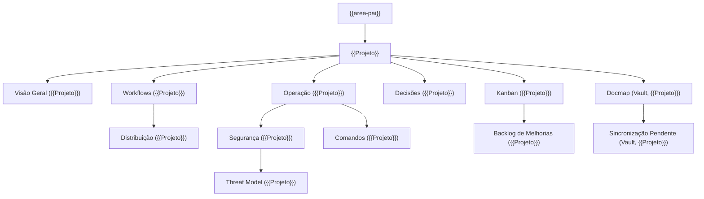

# {{Projeto}}

Convenção de atividades: notas `{{ID}}-*` centralizadas em `06-backlog/atividades/`; criar todas as futuras atividades ali. Quadro, guia, plano e índices sem ID ficam na raiz de `06-backlog/`. IDs nunca renumeram.

> {{descricao}}

Repositório: {{repositorio}} (ou "sem repositório", para projeto só de documentação).

Esta é a nota-raiz do projeto. Tudo abaixo é wikilink: abra o **grafo local**
(`Ctrl+G`) daqui para ver o mapa inteiro.

## Mapa

## Estado

Em **{{data}}**: {{estado em uma ou duas frases: o que existe, o que foi entregue e a evidência (commit, teste, release)}}. Andamento canônico: [[Kanban ({{Projeto}})]].

## Acompanhamento

- [[Kanban ({{Projeto}})]] — pedidos, atividades, critérios de conclusão e bloqueios.
- [[Como usar o Kanban ({{Projeto}})]] — procedimento compartilhado para {{dono}} e agentes.
- [[Plano de execução paralela ({{Projeto}})]] — rodadas, lanes e caminho crítico.

## Navegação

- **Arquitetura:** [[Visão Geral ({{Projeto}})]]
- **Entrega:** [[Workflows ({{Projeto}})]] · [[Distribuição ({{Projeto}})]]
- **Operação:** [[Operação ({{Projeto}})]] · [[Segurança ({{Projeto}})]] · [[Threat Model ({{Projeto}})]] · [[Comandos ({{Projeto}})]]
- **Decisões e evolução:** [[Decisões ({{Projeto}})]] · [[Backlog de Melhorias ({{Projeto}})]]
- **Sincronização:** [[Docmap (Vault, {{Projeto}})]] · [[Sincronização Pendente (Vault, {{Projeto}})]]

## Fronteira

A fonte de verdade do código é o README e o próprio código do repositório.
Esta pasta registra navegação, decisões, evidências e pendências. O que mudar
no código entra aqui pelo [[Docmap (Vault, {{Projeto}})]].

## Ligações

- [[{{area-pai}}|← {{area-pai}}]]
