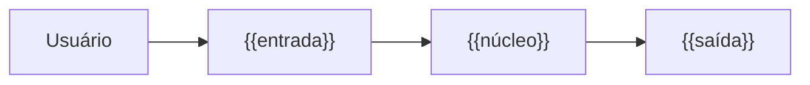

# Visão Geral ({{Projeto}})

## O produto

{{O que é, para quem e onde roda. Linguagem, dependências e requisitos mínimos. Cite a decisão que fixou a pilha:}} [[Decisões ({{Projeto}})#ADR-{{SIGLA}}-001 — {{título}}|ADR-{{SIGLA}}-001]].

## Componentes

| componente | responsabilidade | o que ele **não** faz |
|---|---|---|
| `{{módulo}}` | {{responsabilidade}} | {{limite}} |

## Fluxo

## Limites conhecidos

- {{limite, e a atividade ou decisão que trata dele}}

## Ligações

- [[{{Projeto}}|← {{Projeto}}]] · [[Decisões ({{Projeto}})]] · [[Operação ({{Projeto}})]]
